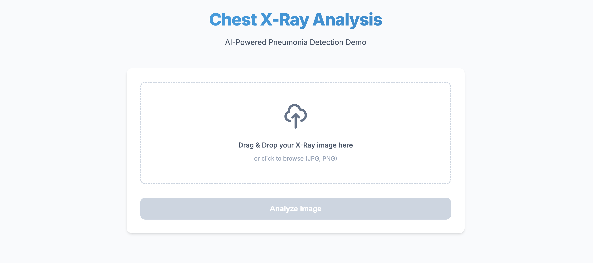

# Chest X-Ray Pneumonia Detection Demo

A modern, AI-powered web application for detecting pneumonia from chest X-ray images. This project demonstrates the deployment of a deep learning model (ResNet18) using FastAPI and a responsive frontend.



## 🚀 Features

*   **AI-Powered Analysis**: Utilizes a pre-trained ResNet18 model fine-tuned for pneumonia detection.
*   **Modern UI**: Clean, responsive interface with drag-and-drop file upload.
*   **Real-time Feedback**: Instant predictions with visual probability bars for "NORMAL" vs "PNEUMONIA".
*   **Production Ready**: Containerized with Docker and CI/CD pipelines via GitHub Actions.
*   **Fast & Efficient**: Built on FastAPI for high-performance inference.

## 🛠️ Tech Stack

*   **Backend**: FastAPI (Python 3.11)
*   **ML Engine**: PyTorch, Torchvision
*   **Frontend**: HTML5, CSS3 (Inter font), Vanilla JavaScript
*   **Dependency Management**: [uv](https://github.com/astral-sh/uv)
*   **Containerization**: Docker

## 🏃‍♂️ Getting Started

### Prerequisites

*   Python 3.11+
*   [uv](https://github.com/astral-sh/uv) (recommended) or pip
*   Docker (optional)

### Local Development

1.  **Clone the repository**
    ```bash
    git clone <repository-url>
    cd app
    ```

2.  **Install dependencies**
    ```bash
    uv sync
    # OR with pip
    pip install -r requirements.txt
    ```

3.  **Run the application**
    ```bash
    uv run uvicorn main:app --reload
    ```

4.  **Access the app**
    Open your browser and navigate to [http://localhost:8000](http://localhost:8000).

### 🐳 Running with Docker

1.  **Build the image**
    ```bash
    docker build -t chest-xray-app .
    ```

2.  **Run the container**
    ```bash
    docker run -p 8000:8000 chest-xray-app
    ```

## 🧪 Running Tests

This project uses `pytest` for unit testing.

```bash
uv run pytest tests
```

## 🔌 API Endpoints

| Method | Endpoint | Description |
| :--- | :--- | :--- |
| `GET` | `/` | Serves the main web interface. |
| `GET` | `/health` | Health check endpoint (returns `{"status": "ok"}`). |
| `POST` | `/predict` | Accepts an image file and returns prediction probabilities. |

## 📂 Project Structure

```
app/
├── ai_model/          # Model artifacts (best_model.pt)
├── static/            # Frontend assets
│   ├── css/
│   ├── js/
│   └── index.html
├── tests/             # Unit tests
├── main.py            # FastAPI application entry point
├── Dockerfile         # Docker configuration
├── pyproject.toml     # Project dependencies (uv)
└── README.md          # Project documentation
```

## 🤝 Contributing

Contributions are welcome! Please feel free to submit a Pull Request.

## 📄 License

[MIT](LICENSE)
